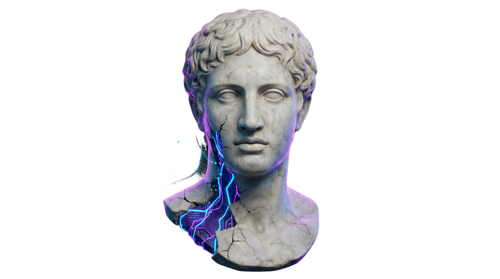

<!-- ═══════════════════════════════════════════════════════════════════════ -->
<!--                    LUCAS DAMAS CORRÊA — PROFILE README                -->
<!-- ═══════════════════════════════════════════════════════════════════════ -->


<div align="center">

  <!-- MASCOT -->
  

  <br/><br/>

  <!-- TYPING SVG -->
  <a href="https://git.io/typing-svg">
    
  </a>

  <br/><br/>

  <!-- PROFILE BADGES -->
  <a href="https://github.com/lucasdcorrea1">
    
  </a>
  <a href="https://github.com/lucasdcorrea1?tab=followers">
    
  </a>
  <a href="https://github.com/lucasdcorrea1?tab=repositories&amp;sort=stargazers">
    
  </a>

  <br/><br/>

  <!-- SOCIAL LINKS -->
  <a href="https://www.whodo.com.br" target="_blank">
    
  </a>
  <a href="https://www.linkedin.com/in/lucas-damas-corr%C3%AAa-882806176/" target="_blank">
    
  </a>
  <a href="mailto:lucas.dcorrea1@gmail.com">
    
  </a>
  <a href="https://www.instagram.com/lucasdcorreabr" target="_blank">
    
  </a>

</div>

<br/>

<br/>

<!-- ═══════════════════════════════════════════════════════════════════════ -->
<!--                             SOBRE MIM                                  -->
<!-- ═══════════════════════════════════════════════════════════════════════ -->

##  Sobre mim

```yaml
name:       Lucas Damas Corrêa
role:       Back-end & Full-Stack Engineer
company:    Founder @ Whodo — Soluções Digitais
location:   Brasil
focus:      [ "APIs escaláveis", "Microsserviços", "Clean Architecture", "DDD" ]
learning:   [ "Event-Driven Architecture", "Kubernetes at scale" ]
motto:      "Código limpo hoje é velocidade de entrega amanhã."
```

<!-- ═══════════════════════════════════════════════════════════════════════ -->
<!--                               WHODO                                    -->
<!-- ═══════════════════════════════════════════════════════════════════════ -->

<div align="center">

### Whodo — Meu projeto atual

<table>
  <tr>
    <td align="center" width="600">
      <br/>
      <a href="https://www.whodo.com.br" target="_blank">
        
      </a>
      <br/><br/>
      <strong>Tecnologia sob medida para impulsionar seu negócio.</strong><br/>
      Desenvolvimento web, APIs robustas, sistemas escaláveis e consultoria tech.<br/>
      Transformo ideias em soluções digitais personalizadas.
      <br/><br/>
    </td>
  </tr>
</table>

</div>

<br/>

<br/>

<!-- ═══════════════════════════════════════════════════════════════════════ -->
<!--                            TECH STACK                                  -->
<!-- ═══════════════════════════════════════════════════════════════════════ -->

## 🧰 Tech Stack

<div align="center">

#### ⚙️ Back-end & Infra


#### 🎨 Front-end


#### 🗄️ Bancos de Dados


#### 🔧 Ferramentas & DevOps


</div>

<br/>

<br/>

<!-- ═══════════════════════════════════════════════════════════════════════ -->
<!--                           GITHUB STATS                                 -->
<!-- ═══════════════════════════════════════════════════════════════════════ -->

## 📊 GitHub Analytics

<div align="center">
  <table>
    <tr>
      <td align="center">
        
      </td>
      <td align="center">
        
      </td>
    </tr>
  </table>
</div>

<div align="center">
  
</div>

<br/>

<div align="center">
  
</div>

<br/>

<br/>

<!-- ═══════════════════════════════════════════════════════════════════════ -->
<!--                         FEATURED PROJECTS                              -->
<!-- ═══════════════════════════════════════════════════════════════════════ -->

## 🚀 Projetos em destaque

<div align="center">
  <table>
    <tr>
      <td align="center">
        <a href="https://github.com/lucasdcorrea1/tron-ares">
          
        </a>
      </td>
      <td align="center">
        <a href="https://github.com/lucasdcorrea1/tron-legacy-api">
          
        </a>
      </td>
    </tr>
    <tr>
      <td align="center">
        <a href="https://github.com/lucasdcorrea1/tron-legacy-frontend">
          
        </a>
      </td>
      <td align="center">
        <a href="https://github.com/lucasdcorrea1/nlw-esports">
          
        </a>
      </td>
    </tr>
  </table>
</div>

<br/>

<br/>

<!-- ═══════════════════════════════════════════════════════════════════════ -->
<!--                          SNAKE ANIMATION                               -->
<!-- ═══════════════════════════════════════════════════════════════════════ -->

## 🐍 Contribuições

<div align="center">
  
</div>

<br/>

<!-- ═══════════════════════════════════════════════════════════════════════ -->
<!--                              FOOTER                                    -->
<!-- ═══════════════════════════════════════════════════════════════════════ -->

<div align="center">
  <sub>Construído com dedicação por <strong>Lucas Damas Corrêa</strong> — <a href="https://www.whodo.com.br">whodo.com.br</a></sub>
</div>

<br/>


