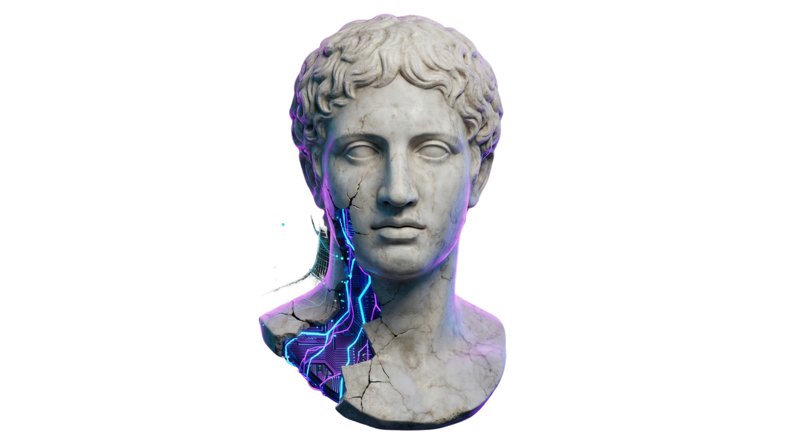

<!-- ═══════════════════════════════════════════════════════════════════════ -->
<!--                    LUCAS DAMAS CORRÊA — PROFILE README                -->
<!-- ═══════════════════════════════════════════════════════════════════════ -->


<div align="center">

  <!-- MASCOT -->
  

  <br/><br/>

  <!-- TYPING SVG -->
  <a href="https://git.io/typing-svg">
    
  </a>

  <br/><br/>

  <!-- PROFILE BADGES -->
  <a href="https://github.com/lucasdcorrea1">
    
  </a>
  <a href="https://github.com/lucasdcorrea1?tab=followers">
    
  </a>
  <a href="https://github.com/lucasdcorrea1?tab=repositories&sort=stargazers">
    
  </a>

  <br/><br/>

  <!-- SOCIAL LINKS -->
  <a href="https://www.whodo.com.br" target="_blank">
    
  </a>
  <a href="https://www.linkedin.com/in/lucas-damas-corr%C3%AAa-882806176/" target="_blank">
    
  </a>
  <a href="mailto:lucas.dcorrea1@gmail.com">
    
  </a>
  <a href="https://www.instagram.com/lucasdcorreabr" target="_blank">
    
  </a>

</div>

<br/>

<br/>

<!-- ═══════════════════════════════════════════════════════════════════════ -->
<!--                             SOBRE MIM                                  -->
<!-- ═══════════════════════════════════════════════════════════════════════ -->

##  Sobre mim

```yaml
name:       Lucas Damas Corrêa
role:       Desenvolvedor Fullstack Pleno @ CI&T
stack:      [ ".NET", "C#", "Angular" ]
side:       Founder @ Whodo — Soluções Digitais
location:   Brasil
focus:      [ "APIs escaláveis", "Microsserviços", "Clean Architecture", "DDD" ]
learning:   [ "Event-Driven Architecture", "Kubernetes at scale", "Cloud Native" ]
motto:      "Código limpo hoje é velocidade de entrega amanhã."
```

<br/>

<!-- ═══════════════════════════════════════════════════════════════════════ -->
<!--                        ATUAÇÃO PROFISSIONAL                            -->
<!-- ═══════════════════════════════════════════════════════════════════════ -->

## 💼 Atuação Profissional

<div align="center">

<table>
  <tr>
    <td align="center" width="50%">
      <br/>
      
      <br/><br/>
      <a href="https://ciandt.com" target="_blank">
        
      </a>
      <br/><br/>
      <strong>CI&T</strong><br/>
      Desenvolvedor Fullstack Pleno com .NET (C#) no back-end<br/>
      e Angular no front-end, em projetos de escala global.
      <br/><br/>
    </td>
    <td align="center" width="50%">
      <br/>
      
      <br/><br/>
      <a href="https://www.whodo.com.br" target="_blank">
        
      </a>
      <br/><br/>
      <strong>Whodo — Soluções Digitais</strong><br/>
      Desenvolvimento web, APIs robustas e sistemas escaláveis.<br/>
      Transformo ideias em soluções digitais sob medida.
      <br/><br/>
    </td>
  </tr>
</table>

</div>

<br/>

<br/>

<!-- ═══════════════════════════════════════════════════════════════════════ -->
<!--                     METODOLOGIAS E PRINCÍPIOS                          -->
<!-- ═══════════════════════════════════════════════════════════════════════ -->

## 🎯 Metodologias & Princípios

<div align="center">

<table>
  <tr>
    <td align="center" width="25%">
      
      <br/><sub>Arquitetura desacoplada e testável</sub>
    </td>
    <td align="center" width="25%">
      
      <br/><sub>Modelagem focada no domínio</sub>
    </td>
    <td align="center" width="25%">
      
      <br/><sub>Código manutenível e extensível</sub>
    </td>
    <td align="center" width="25%">
      
      <br/><sub>Testes que guiam o design</sub>
    </td>
  </tr>
  <tr>
    <td align="center">
      
      <br/><sub>Integração e entrega contínua</sub>
    </td>
    <td align="center">
      
      <br/><sub>Entregas iterativas e colaborativas</sub>
    </td>
    <td align="center">
      
      <br/><sub>Qualidade através de revisão</sub>
    </td>
    <td align="center">
      
      <br/><sub>Apps cloud-native</sub>
    </td>
  </tr>
</table>

</div>

<br/>

<br/>

<!-- ═══════════════════════════════════════════════════════════════════════ -->
<!--                            TECH STACK                                  -->
<!-- ═══════════════════════════════════════════════════════════════════════ -->

## 🧰 Tech Stack

<div align="center">

#### ⚙️ Back-end & Infra


#### 🎨 Front-end


#### 🗄️ Bancos de Dados


#### ☁️ Cloud & DevOps


</div>

<br/>

<br/>

<!-- ═══════════════════════════════════════════════════════════════════════ -->
<!--                              IDIOMAS                                   -->
<!-- ═══════════════════════════════════════════════════════════════════════ -->

## 🌐 Idiomas

<div align="center">

| Idioma | Nível | Proficiência |
|:------:|:-----:|:------------:|
| 🇧🇷 **Português** | Nativo | ████████████ 100% |
| 🇺🇸 **English** | Intermediário | ████████░░░░ 65% |

</div>

<br/>

<br/>

<!-- ═══════════════════════════════════════════════════════════════════════ -->
<!--                          GITHUB TROPHIES                               -->
<!-- ═══════════════════════════════════════════════════════════════════════ -->

## 🏆 GitHub Trophies

<div align="center">
  
</div>

<br/>

<br/>

<!-- ═══════════════════════════════════════════════════════════════════════ -->
<!--                           GITHUB STATS                                 -->
<!-- ═══════════════════════════════════════════════════════════════════════ -->

## 📊 GitHub Analytics

<div align="center">
  <table>
    <tr>
      <td align="center">
        
      </td>
      <td align="center">
        
      </td>
    </tr>
  </table>
</div>

<div align="center">
  
</div>

<br/>

<div align="center">
  
</div>

<br/>

<!-- ═══════════════════════════════════════════════════════════════════════ -->
<!--                           WAKATIME STATS                               -->
<!-- ═══════════════════════════════════════════════════════════════════════ -->

<!--
## ⏱️ WakaTime Stats

Para ativar esta seção:
1. Crie uma conta em https://wakatime.com
2. Instale o plugin no VS Code
3. Descomente o bloco abaixo e substitua SEU_USERNAME

<div align="center">
  
</div>
-->


<br/>

<!-- ═══════════════════════════════════════════════════════════════════════ -->
<!--                         FEATURED PROJECTS                              -->
<!-- ═══════════════════════════════════════════════════════════════════════ -->

## 🚀 Projetos em destaque

<div align="center">
  <table>
    <tr>
      <td align="center">
        <a href="https://github.com/lucasdcorrea1/tron-ares">
          
        </a>
      </td>
      <td align="center">
        <a href="https://github.com/lucasdcorrea1/tron-legacy-api">
          
        </a>
      </td>
    </tr>
    <tr>
      <td align="center">
        <a href="https://github.com/lucasdcorrea1/tron-legacy-frontend">
          
        </a>
      </td>
      <td align="center">
        <a href="https://github.com/lucasdcorrea1/nlw-esports">
          
        </a>
      </td>
    </tr>
  </table>
</div>

<br/>

<br/>

<!-- ═══════════════════════════════════════════════════════════════════════ -->
<!--                          SNAKE ANIMATION                               -->
<!-- ═══════════════════════════════════════════════════════════════════════ -->

## 🐍 Contribuições

<div align="center">
  
</div>

<br/>

<!-- ═══════════════════════════════════════════════════════════════════════ -->
<!--                         CONNECT WITH ME                                -->
<!-- ═══════════════════════════════════════════════════════════════════════ -->

## 🤝 Vamos conversar?

<div align="center">

Estou sempre aberto a novos projetos, consultorias e parcerias.

<br/>

<a href="https://www.linkedin.com/in/lucas-damas-corr%C3%AAa-882806176/" target="_blank">
  
</a>
<a href="mailto:lucas.dcorrea1@gmail.com">
  
</a>
<a href="https://www.whodo.com.br" target="_blank">
  
</a>

</div>

<br/>

<!-- ═══════════════════════════════════════════════════════════════════════ -->
<!--                              FOOTER                                    -->
<!-- ═══════════════════════════════════════════════════════════════════════ -->

<div align="center">
  <sub>Construído com dedicação por <strong>Lucas Damas Corrêa</strong> — <a href="https://www.whodo.com.br">whodo.com.br</a></sub>
</div>

<br/>


